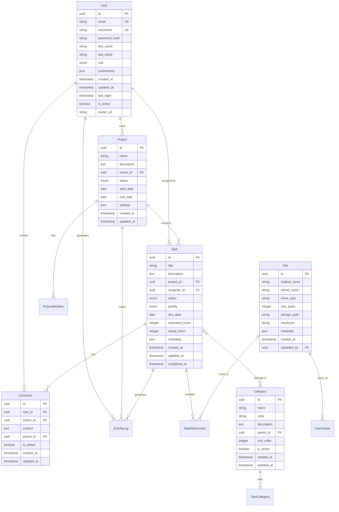

# Design Document

## Overview

The Comprehensive NestJS Learning Platform is designed as an advanced task management system that serves as a complete educational resource demonstrating every major NestJS concept, pattern, and technique. The system follows a modular, scalable architecture that naturally incorporates all NestJS features while maintaining educational clarity and avoiding common development pitfalls.

### Educational Philosophy

This design prioritizes **depth over breadth** - each feature is implemented to demonstrate specific NestJS concepts with clear explanations of the what, why, and how. The system serves as a living documentation of NestJS best practices, showing not just how to implement features, but when and why to use different approaches.

### Anti-Pattern Avoidance Strategy

Based on research into common NestJS mistakes, this design explicitly avoids:
- **Tight coupling** through proper dependency injection patterns
- **Overuse of decorators** by balancing simplicity with functionality  
- **Poor error handling** through comprehensive exception strategies
- **Performance neglect** via caching, optimization, and monitoring
- **Testing gaps** through comprehensive test coverage
- **Circular dependencies** through proper module organization
- **Magic numbers and unclear naming** through constants and descriptive names
- **Monolithic functions** through proper separation of concerns

## Architecture

### High-Level Architecture

The system follows a **layered modular architecture** with clear separation of concerns:

```
┌─────────────────────────────────────────────────────────────┐
│                    Presentation Layer                       │
│  ┌─────────────┐ ┌─────────────┐ ┌─────────────────────────┐ │
│  │ REST APIs   │ │ GraphQL     │ │ WebSocket Gateways      │ │
│  │ (Express/   │ │ Resolvers   │ │ (Real-time Updates)     │ │
│  │ Fastify)    │ │             │ │                         │ │
│  └─────────────┘ └─────────────┘ └─────────────────────────┘ │
└─────────────────────────────────────────────────────────────┘
┌─────────────────────────────────────────────────────────────┐
│                   Application Layer                         │
│  ┌─────────────┐ ┌─────────────┐ ┌─────────────────────────┐ │
│  │ Controllers │ │ Guards      │ │ Interceptors            │ │
│  │ (HTTP)      │ │ (Auth/      │ │ (Transform/Cache/Log)   │ │
│  │             │ │ Authz)      │ │                         │ │
│  └─────────────┘ └─────────────┘ └─────────────────────────┘ │
│  ┌─────────────┐ ┌─────────────┐ ┌─────────────────────────┐ │
│  │ Pipes       │ │ Filters     │ │ Middleware              │ │
│  │ (Validation)│ │ (Exception) │ │ (Request Processing)    │ │
│  └─────────────┘ └─────────────┘ └─────────────────────────┘ │
└─────────────────────────────────────────────────────────────┘
┌─────────────────────────────────────────────────────────────┐
│                    Business Layer                           │
│  ┌─────────────┐ ┌─────────────┐ ┌─────────────────────────┐ │
│  │ Services    │ │ CQRS        │ │ Event Handlers          │ │
│  │ (Business   │ │ (Commands/  │ │ (Domain Events)         │ │
│  │ Logic)      │ │ Queries)    │ │                         │ │
│  └─────────────┘ └─────────────┘ └─────────────────────────┘ │
└─────────────────────────────────────────────────────────────┘
┌─────────────────────────────────────────────────────────────┐
│                    Data Layer                               │
│  ┌─────────────┐ ┌─────────────┐ ┌─────────────────────────┐ │
│  │ Repositories│ │ TypeORM     │ │ Cache (Redis/Memory)    │ │
│  │ (Data       │ │ Entities    │ │                         │ │
│  │ Access)     │ │             │ │                         │ │
│  └─────────────┘ └─────────────┘ └─────────────────────────┘ │
└─────────────────────────────────────────────────────────────┘
┌─────────────────────────────────────────────────────────────┐
│                Infrastructure Layer                         │
│  ┌─────────────┐ ┌─────────────┐ ┌─────────────────────────┐ │
│  │ Database    │ │ Message     │ │ External Services       │ │
│  │ (PostgreSQL)│ │ Queues      │ │ (Email, File Storage)   │ │
│  │             │ │ (Redis/Bull)│ │                         │ │
│  └─────────────┘ └─────────────┘ └─────────────────────────┘ │
└─────────────────────────────────────────────────────────────┘
```

### Module Organization Strategy

The system uses a **feature-based module organization** with clear boundaries and responsibilities:

#### Core Modules
- **AppModule**: Root module demonstrating global configuration and module orchestration
- **SharedModule**: Global utilities and common services with @Global decorator
- **ConfigurationModule**: Dynamic module with forRoot/forRootAsync patterns
- **DatabaseModule**: Async module configuration with multiple ORM examples

#### Feature Modules
- **AuthModule**: Multi-strategy authentication (Local, JWT, OAuth2, API Key, 2FA)
- **UsersModule**: User management with comprehensive DI patterns
- **ProjectsModule**: Project management with standard CRUD operations
- **TasksModule**: Core business logic with CQRS pattern implementation
- **CategoriesModule**: Many-to-many relationships demonstration
- **CommentsModule**: Nested resources and hierarchical data
- **FilesModule**: File upload, processing, and streaming
- **NotificationsModule**: WebSocket gateway with real-time features
- **AnalyticsModule**: GraphQL-focused module with complex resolvers
- **ReportsModule**: Microservice communication patterns

#### Cross-Cutting Modules
- **LoggingModule**: Structured logging with multiple transports
- **CacheModule**: Multi-tier caching strategies
- **QueueModule**: Background job processing with Bull
- **SchedulerModule**: Cron jobs and scheduled tasks
- **HealthModule**: Health checks and monitoring

### Request Processing Pipeline

The system implements the complete NestJS request processing pipeline with educational examples at each stage:

```
Request → Middleware → Guards → Interceptors (Before) → Pipes → Handler → Interceptors (After) → Exception Filters → Response
```

#### Middleware Layer
- **LoggingMiddleware**: Request/response logging with correlation IDs
- **CompressionMiddleware**: Response compression for performance
- **SecurityMiddleware**: Security headers and CORS configuration
- **RateLimitMiddleware**: Request throttling and DDoS protection

#### Guards Layer
- **AuthenticationGuard**: JWT token validation
- **AuthorizationGuard**: Role-based access control (RBAC)
- **PermissionGuard**: Resource-level permissions
- **ThrottleGuard**: Rate limiting per user/endpoint

#### Interceptors Layer
- **LoggingInterceptor**: Detailed request/response logging
- **TransformInterceptor**: Response data transformation
- **CacheInterceptor**: Response caching with TTL
- **TimeoutInterceptor**: Request timeout handling
- **ErrorMappingInterceptor**: Exception transformation

#### Pipes Layer
- **ValidationPipe**: Input validation with class-validator
- **TransformPipe**: Data type transformation
- **ParseIntPipe**: Integer parsing with validation
- **ParseUUIDPipe**: UUID validation and parsing
- **CustomValidationPipe**: Business rule validation

#### Exception Filters Layer
- **HttpExceptionFilter**: HTTP exception handling
- **ValidationExceptionFilter**: Validation error formatting
- **DatabaseExceptionFilter**: Database error handling
- **GlobalExceptionFilter**: Catch-all error handling

## Components and Interfaces

### Core Interfaces

#### Authentication Interfaces
```typescript
interface IAuthenticationStrategy {
  validate(payload: any): Promise<User | null>;
  authenticate(credentials: any): Promise<AuthResult>;
}

interface IAuthorizationService {
  hasRole(user: User, role: Role): boolean;
  hasPermission(user: User, resource: string, action: string): boolean;
  canAccess(user: User, resource: any): Promise<boolean>;
}

interface ITokenService {
  generateAccessToken(user: User): string;
  generateRefreshToken(user: User): string;
  validateToken(token: string): Promise<TokenPayload>;
  revokeToken(token: string): Promise<void>;
}
```

#### Repository Interfaces
```typescript
interface IBaseRepository<T> {
  create(entity: Partial<T>): Promise<T>;
  findById(id: string): Promise<T | null>;
  findAll(options?: FindOptions): Promise<T[]>;
  update(id: string, updates: Partial<T>): Promise<T>;
  delete(id: string): Promise<void>;
}

interface ITaskRepository extends IBaseRepository<Task> {
  findByProject(projectId: string): Promise<Task[]>;
  findByAssignee(userId: string): Promise<Task[]>;
  findOverdue(): Promise<Task[]>;
  updateStatus(id: string, status: TaskStatus): Promise<Task>;
}
```

#### Service Interfaces
```typescript
interface ICacheService {
  get<T>(key: string): Promise<T | null>;
  set<T>(key: string, value: T, ttl?: number): Promise<void>;
  delete(key: string): Promise<void>;
  clear(): Promise<void>;
}

interface INotificationService {
  sendEmail(to: string, template: string, data: any): Promise<void>;
  sendPush(userId: string, message: string): Promise<void>;
  sendWebSocket(room: string, event: string, data: any): Promise<void>;
}
```

### Component Architecture

#### Dependency Injection Patterns

The system demonstrates **all NestJS DI patterns** with clear examples:

**Constructor Injection (Primary Pattern)**
```typescript
@Injectable()
export class TaskService {
  constructor(
    private readonly taskRepository: ITaskRepository,
    private readonly eventEmitter: EventEmitter2,
    private readonly logger: Logger,
  ) {}
}
```

**Property Injection with Custom Tokens**
```typescript
@Injectable()
export class ConfigService {
  @Inject('DATABASE_CONFIG')
  private readonly dbConfig: DatabaseConfig;
  
  @Inject('FEATURE_FLAGS')
  private readonly featureFlags: FeatureFlags;
}
```

**Factory Providers**
```typescript
{
  provide: 'DATABASE_CONNECTION',
  useFactory: async (configService: ConfigService) => {
    const config = configService.get('database');
    return createConnection(config);
  },
  inject: [ConfigService],
}
```

**Async Providers**
```typescript
{
  provide: 'REDIS_CLIENT',
  useFactory: async (configService: ConfigService) => {
    const redis = new Redis(configService.get('redis'));
    await redis.ping();
    return redis;
  },
  inject: [ConfigService],
}
```

#### Module Patterns

**Dynamic Modules with Configuration**
```typescript
@Module({})
export class DatabaseModule {
  static forRoot(options: DatabaseOptions): DynamicModule {
    return {
      module: DatabaseModule,
      providers: [
        {
          provide: 'DATABASE_OPTIONS',
          useValue: options,
        },
        DatabaseService,
      ],
      exports: [DatabaseService],
      global: true,
    };
  }

  static forRootAsync(options: DatabaseAsyncOptions): DynamicModule {
    return {
      module: DatabaseModule,
      imports: options.imports || [],
      providers: [
        {
          provide: 'DATABASE_OPTIONS',
          useFactory: options.useFactory,
          inject: options.inject || [],
        },
        DatabaseService,
      ],
      exports: [DatabaseService],
      global: true,
    };
  }
}
```

## Data Models

### Entity Relationship Design

The system uses a comprehensive data model that demonstrates all relationship types:



### TypeORM Entity Implementation

**User Entity (Comprehensive Example)**
```typescript
@Entity('users')
@Index(['email'], { unique: true })
@Index(['username'], { unique: true })
export class User {
  @PrimaryGeneratedColumn('uuid')
  id: string;

  @Column({ unique: true, length: 255 })
  @IsEmail()
  email: string;

  @Column({ unique: true, length: 50 })
  @Length(3, 50)
  username: string;

  @Column({ name: 'password_hash' })
  @Exclude()
  passwordHash: string;

  @Column({ name: 'first_name', length: 100 })
  @Length(1, 100)
  firstName: string;

  @Column({ name: 'last_name', length: 100 })
  @Length(1, 100)
  lastName: string;

  @Column({
    type: 'enum',
    enum: UserRole,
    default: UserRole.USER,
  })
  role: UserRole;

  @Column({ type: 'jsonb', nullable: true })
  preferences: UserPreferences;

  @CreateDateColumn({ name: 'created_at' })
  createdAt: Date;

  @UpdateDateColumn({ name: 'updated_at' })
  updatedAt: Date;

  @Column({ name: 'last_login', nullable: true })
  lastLogin: Date;

  @Column({ name: 'is_active', default: true })
  isActive: boolean;

  @Column({ name: 'avatar_url', nullable: true })
  avatarUrl: string;

  // Relationships
  @OneToMany(() => Project, project => project.owner)
  ownedProjects: Project[];

  @OneToMany(() => Task, task => task.assignee)
  assignedTasks: Task[];

  @OneToMany(() => Comment, comment => comment.author)
  comments: Comment[];

  @OneToMany(() => ActivityLog, log => log.user)
  activityLogs: ActivityLog[];

  @ManyToMany(() => Project, project => project.members)
  memberProjects: Project[];

  // Virtual properties
  @Expose()
  get fullName(): string {
    return `${this.firstName} ${this.lastName}`;
  }

  @Expose()
  get isAdmin(): boolean {
    return this.role === UserRole.ADMIN;
  }
}
```

**Task Entity (Complex Relationships)**
```typescript
@Entity('tasks')
@Index(['project_id', 'status'])
@Index(['assignee_id', 'due_date'])
export class Task {
  @PrimaryGeneratedColumn('uuid')
  id: string;

  @Column({ length: 255 })
  @Length(1, 255)
  title: string;

  @Column({ type: 'text', nullable: true })
  description: string;

  @Column({ name: 'project_id' })
  projectId: string;

  @Column({ name: 'assignee_id', nullable: true })
  assigneeId: string;

  @Column({
    type: 'enum',
    enum: TaskStatus,
    default: TaskStatus.TODO,
  })
  status: TaskStatus;

  @Column({
    type: 'enum',
    enum: TaskPriority,
    default: TaskPriority.MEDIUM,
  })
  priority: TaskPriority;

  @Column({ name: 'due_date', nullable: true })
  dueDate: Date;

  @Column({ name: 'estimated_hours', nullable: true })
  @Min(0)
  estimatedHours: number;

  @Column({ name: 'actual_hours', nullable: true })
  @Min(0)
  actualHours: number;

  @Column({ type: 'jsonb', nullable: true })
  metadata: TaskMetadata;

  @CreateDateColumn({ name: 'created_at' })
  createdAt: Date;

  @UpdateDateColumn({ name: 'updated_at' })
  updatedAt: Date;

  @Column({ name: 'completed_at', nullable: true })
  completedAt: Date;

  // Relationships
  @ManyToOne(() => Project, project => project.tasks, {
    onDelete: 'CASCADE',
  })
  @JoinColumn({ name: 'project_id' })
  project: Project;

  @ManyToOne(() => User, user => user.assignedTasks, {
    nullable: true,
  })
  @JoinColumn({ name: 'assignee_id' })
  assignee: User;

  @OneToMany(() => Comment, comment => comment.task, {
    cascade: true,
  })
  comments: Comment[];

  @OneToMany(() => TaskAttachment, attachment => attachment.task, {
    cascade: true,
  })
  attachments: TaskAttachment[];

  @ManyToMany(() => Category, category => category.tasks)
  @JoinTable({
    name: 'task_categories',
    joinColumn: { name: 'task_id' },
    inverseJoinColumn: { name: 'category_id' },
  })
  categories: Category[];

  @OneToMany(() => ActivityLog, log => log.task)
  activityLogs: ActivityLog[];

  // Virtual properties
  @Expose()
  get isOverdue(): boolean {
    return this.dueDate && this.dueDate < new Date() && this.status !== TaskStatus.COMPLETED;
  }

  @Expose()
  get progressPercentage(): number {
    if (!this.estimatedHours) return 0;
    return Math.min(100, (this.actualHours || 0) / this.estimatedHours * 100);
  }
}
```

### Data Transfer Objects (DTOs)

**Comprehensive DTO Examples with Validation**

```typescript
// Create Task DTO
export class CreateTaskDto {
  @IsString()
  @Length(1, 255)
  @ApiProperty({ description: 'Task title', example: 'Implement user authentication' })
  title: string;

  @IsOptional()
  @IsString()
  @MaxLength(2000)
  @ApiProperty({ description: 'Task description', required: false })
  description?: string;

  @IsUUID()
  @ApiProperty({ description: 'Project ID', format: 'uuid' })
  projectId: string;

  @IsOptional()
  @IsUUID()
  @ApiProperty({ description: 'Assignee user ID', format: 'uuid', required: false })
  assigneeId?: string;

  @IsEnum(TaskPriority)
  @ApiProperty({ enum: TaskPriority, default: TaskPriority.MEDIUM })
  priority: TaskPriority = TaskPriority.MEDIUM;

  @IsOptional()
  @IsDateString()
  @ApiProperty({ description: 'Due date', type: 'string', format: 'date-time', required: false })
  dueDate?: string;

  @IsOptional()
  @IsInt()
  @Min(0)
  @Max(1000)
  @ApiProperty({ description: 'Estimated hours', minimum: 0, maximum: 1000, required: false })
  estimatedHours?: number;

  @IsOptional()
  @IsArray()
  @IsUUID('4', { each: true })
  @ApiProperty({ description: 'Category IDs', type: [String], required: false })
  categoryIds?: string[];

  @IsOptional()
  @ValidateNested()
  @Type(() => TaskMetadataDto)
  @ApiProperty({ description: 'Additional metadata', required: false })
  metadata?: TaskMetadataDto;
}

// Update Task DTO
export class UpdateTaskDto extends PartialType(CreateTaskDto) {
  @IsOptional()
  @IsEnum(TaskStatus)
  @ApiProperty({ enum: TaskStatus, required: false })
  status?: TaskStatus;

  @IsOptional()
  @IsInt()
  @Min(0)
  @Max(1000)
  @ApiProperty({ description: 'Actual hours worked', minimum: 0, maximum: 1000, required: false })
  actualHours?: number;
}

// Task Response DTO
export class TaskResponseDto {
  @ApiProperty({ format: 'uuid' })
  id: string;

  @ApiProperty()
  title: string;

  @ApiProperty({ required: false })
  description?: string;

  @ApiProperty({ format: 'uuid' })
  projectId: string;

  @ApiProperty({ required: false, format: 'uuid' })
  assigneeId?: string;

  @ApiProperty({ enum: TaskStatus })
  status: TaskStatus;

  @ApiProperty({ enum: TaskPriority })
  priority: TaskPriority;

  @ApiProperty({ required: false, type: 'string', format: 'date-time' })
  dueDate?: Date;

  @ApiProperty({ required: false })
  estimatedHours?: number;

  @ApiProperty({ required: false })
  actualHours?: number;

  @ApiProperty({ type: 'string', format: 'date-time' })
  createdAt: Date;

  @ApiProperty({ type: 'string', format: 'date-time' })
  updatedAt: Date;

  @ApiProperty({ required: false, type: 'string', format: 'date-time' })
  completedAt?: Date;

  // Computed properties
  @ApiProperty({ description: 'Whether the task is overdue' })
  @Expose()
  isOverdue: boolean;

  @ApiProperty({ description: 'Progress percentage based on estimated vs actual hours' })
  @Expose()
  progressPercentage: number;

  // Related entities (when populated)
  @ApiProperty({ type: () => ProjectResponseDto, required: false })
  @Expose()
  project?: ProjectResponseDto;

  @ApiProperty({ type: () => UserResponseDto, required: false })
  @Expose()
  assignee?: UserResponseDto;

  @ApiProperty({ type: [CategoryResponseDto], required: false })
  @Expose()
  categories?: CategoryResponseDto[];

  @ApiProperty({ type: [CommentResponseDto], required: false })
  @Expose()
  comments?: CommentResponseDto[];
}
```

Now I need to use the prework tool to analyze the acceptance criteria before writing the correctness properties section.

<function_calls>
<invoke name="prework">
<parameter name="featureName">comprehensive-nestjs-learning-platform

## Correctness Properties

*A property is a characteristic or behavior that should hold true across all valid executions of a system-essentially, a formal statement about what the system should do. Properties serve as the bridge between human-readable specifications and machine-verifiable correctness guarantees.*

### Property Reflection

After analyzing all acceptance criteria, I identified several areas where properties could be consolidated to eliminate redundancy:

- **Module configuration properties** can be combined into comprehensive module validation properties
- **Authentication strategy properties** can be unified into authentication workflow properties  
- **Request pipeline properties** can be consolidated into pipeline execution order properties
- **Database operation properties** can be combined into data integrity properties
- **Validation properties** can be unified into input validation properties

The following properties represent the essential, non-redundant correctness guarantees for the system:

### Core Architecture Properties

**Property 1: Module Dependency Resolution**
*For any* module configuration with dependencies, importing the module should successfully resolve all dependencies without circular reference errors
**Validates: Requirements 1.6, 2.11**

**Property 2: Dynamic Module Configuration**
*For any* dynamic module with forRoot/forRootAsync patterns, the module should properly configure providers based on the provided options
**Validates: Requirements 1.4**

**Property 3: Injection Scope Behavior**
*For any* provider with a specific injection scope (DEFAULT, REQUEST, TRANSIENT), the provider should create instances according to its scope definition
**Validates: Requirements 2.10**

**Property 4: Factory Provider Creation**
*For any* factory provider with dependencies, the factory should receive all required dependencies and create the expected instance
**Validates: Requirements 2.5, 2.8**

**Property 5: Multi-Provider Aggregation**
*For any* multi-provider token, injecting the token should return an array containing all registered providers for that token
**Validates: Requirements 2.9**

**Property 6: Optional Dependency Handling**
*For any* service with optional dependencies, the service should function correctly when optional dependencies are not available
**Validates: Requirements 2.3**

**Property 7: Dynamic Provider Resolution**
*For any* provider resolved through ModuleRef, the resolution should return the same instance as constructor injection would provide
**Validates: Requirements 2.12**

### Request Processing Properties

**Property 8: Pipeline Execution Order**
*For any* HTTP request, the processing components should execute in the exact order: middleware → guards → interceptors (before) → pipes → handler → interceptors (after) → exception filters
**Validates: Requirements 3.8**

**Property 9: Component Scope Application**
*For any* component applied at global, controller, or method level, the component should only affect requests within its defined scope
**Validates: Requirements 3.9**

**Property 10: Error Propagation Through Pipeline**
*For any* error thrown during request processing, the error should be caught by the appropriate exception filter and not propagate beyond the pipeline
**Validates: Requirements 3.10**

**Property 11: Middleware Execution Order**
*For any* request with multiple middleware, the middleware should execute in the order they were registered
**Validates: Requirements 3.1**

**Property 12: Guard Authorization Logic**
*For any* protected route with authentication and authorization guards, access should be granted only when both authentication and authorization succeed
**Validates: Requirements 3.2, 3.3**

**Property 13: Interceptor Data Transformation**
*For any* request processed by transformation interceptors, the response data should be transformed according to the interceptor's logic
**Validates: Requirements 3.4**

**Property 14: Pipe Validation and Transformation**
*For any* input data processed by validation pipes, invalid data should be rejected with clear error messages, and valid data should be transformed appropriately
**Validates: Requirements 3.5, 3.6**

### Controller and Routing Properties

**Property 15: Parameter Extraction Accuracy**
*For any* controller method with parameter decorators (@Param, @Query, @Body), the decorators should extract the correct data from the request
**Validates: Requirements 4.2**

**Property 16: Async Handler Response Handling**
*For any* async controller method returning Promises or Observables, the response should be properly awaited and returned to the client
**Validates: Requirements 4.4**

**Property 17: HTTP Status Code Consistency**
*For any* endpoint with @HttpCode decorator, the response should return the specified HTTP status code
**Validates: Requirements 4.5**

**Property 18: File Upload Validation**
*For any* file upload request, files should be validated for type, size, and content before processing
**Validates: Requirements 4.8**

**Property 19: Error Response Formatting**
*For any* error occurring in a controller, the error response should contain meaningful information for debugging and user feedback
**Validates: Requirements 4.9**

**Property 20: Input Validation Completeness**
*For any* endpoint receiving input data, all inputs should be validated and appropriate responses should be returned
**Validates: Requirements 4.10**

### Custom Decorator Properties

**Property 21: Parameter Decorator Data Extraction**
*For any* custom parameter decorator, the decorator should correctly extract and transform data from the request context
**Validates: Requirements 5.1, 5.7**

**Property 22: Method Decorator Metadata Application**
*For any* method decorator applied to a route handler, the decorator should properly set metadata that can be retrieved by guards and interceptors
**Validates: Requirements 5.2, 5.6**

### Database Integration Properties

**Property 23: Entity Relationship Integrity**
*For any* database operation involving related entities, the operation should maintain referential integrity across all relationship types
**Validates: Requirements 6.2, 6.8**

**Property 24: Repository Operation Consistency**
*For any* repository operation (create, read, update, delete), the operation should behave consistently across custom repositories and query builders
**Validates: Requirements 6.3**

**Property 25: Transaction Atomicity**
*For any* database transaction, either all operations within the transaction should succeed, or all should be rolled back
**Validates: Requirements 6.4**

**Property 26: Connection Management Reliability**
*For any* database connection configuration, the system should properly manage multiple database connections without conflicts
**Validates: Requirements 6.7**

**Property 27: Loading Strategy Consistency**
*For any* entity with eager or lazy loading configuration, the loading strategy should be applied consistently across all queries
**Validates: Requirements 6.9**

**Property 28: Database Error Handling**
*For any* database operation that fails, the error should be properly caught and transformed into an appropriate application error
**Validates: Requirements 6.10**

### Validation and Serialization Properties

**Property 29: Validation Decorator Effectiveness**
*For any* DTO with validation decorators, invalid data should be rejected with specific error messages indicating which validation rules failed
**Validates: Requirements 7.1, 7.8**

**Property 30: Nested Validation Completeness**
*For any* DTO with nested objects using @ValidateNested, validation should be applied recursively to all nested properties
**Validates: Requirements 7.2**

**Property 31: Custom Validator Business Rule Enforcement**
*For any* custom validator implementing business rules, the validator should correctly enforce the business logic across all applicable inputs
**Validates: Requirements 7.3**

**Property 32: ValidationPipe Configuration Consistency**
*For any* ValidationPipe configuration option, the pipe should behave according to the specified configuration across all endpoints
**Validates: Requirements 7.4**

**Property 33: Serialization Data Protection**
*For any* response containing sensitive data, the serialization process should exclude sensitive fields and only expose intended data
**Validates: Requirements 7.5, 7.6, 7.10**

**Property 34: Data Type Transformation Accuracy**
*For any* input data requiring type transformation, the transformation should convert data to the correct types without data loss
**Validates: Requirements 7.9**

### Authentication Properties

**Property 35: Authentication Strategy Validation**
*For any* authentication strategy (local, JWT, OAuth2, API key), the strategy should correctly validate credentials and return appropriate authentication results
**Validates: Requirements 8.1, 8.2, 8.4, 8.5**

**Property 36: Token Generation and Validation**
*For any* JWT authentication, generated tokens should be valid and contain correct user information, and token validation should accurately verify token authenticity
**Validates: Requirements 8.2, 8.8**

**Property 37: Two-Factor Authentication Workflow**
*For any* user with 2FA enabled, the authentication process should require both primary credentials and valid TOTP codes
**Validates: Requirements 8.6**

**Property 38: Authentication Guard Protection**
*For any* route protected by authentication guards, access should be denied for unauthenticated requests and allowed for valid authenticated requests
**Validates: Requirements 8.7**

**Property 39: Authentication Failure Handling**
*For any* failed authentication attempt, the system should return appropriate error messages without revealing sensitive information
**Validates: Requirements 8.9**

**Property 40: Password Security**
*For any* password storage or validation, passwords should be securely hashed using bcrypt and never stored in plain text
**Validates: Requirements 8.10**

### Authorization Properties

**Property 41: Role-Based Access Control**
*For any* user with specific roles, access to resources should be granted or denied based on the user's role hierarchy
**Validates: Requirements 9.1, 9.7**

**Property 42: Permission-Based Authorization**
*For any* CRUD operation on a resource, access should be granted only if the user has the specific permission for that operation
**Validates: Requirements 9.2**

**Property 43: Resource Ownership Validation**
*For any* resource access attempt, users should only be able to access resources they own or have explicit permission to access
**Validates: Requirements 9.4**

**Property 44: Authorization Guard Integration**
*For any* route with both authentication and authorization guards, authorization should only be checked after successful authentication
**Validates: Requirements 9.5**

**Property 45: Dynamic Permission Evaluation**
*For any* permission check involving resource context, the permission evaluation should consider the specific resource attributes and user context
**Validates: Requirements 9.9**

**Property 46: Authorization Audit Logging**
*For any* authorization decision (grant or deny), the decision should be logged with sufficient detail for security monitoring
**Validates: Requirements 9.10**

**Property 47: Unauthorized Access Response**
*For any* unauthorized access attempt, the system should return 403 Forbidden with clear but non-revealing error messages
**Validates: Requirements 9.8**

### Security Properties

**Property 48: CSRF Protection Validation**
*For any* state-changing request, CSRF tokens should be validated to prevent cross-site request forgery attacks
**Validates: Requirements 10.3**

**Property 49: Rate Limiting Enforcement**
*For any* client making requests, the rate limiting should enforce configured limits and reject requests that exceed the threshold
**Validates: Requirements 10.4**

**Property 50: Input Sanitization Effectiveness**
*For any* user input, the sanitization process should remove or escape potentially malicious content to prevent XSS and injection attacks
**Validates: Requirements 10.5**

**Property 51: Data Encryption Integrity**
*For any* sensitive data, the data should be encrypted at rest and in transit using appropriate encryption algorithms
**Validates: Requirements 10.6**

**Property 52: Security Threat Response**
*For any* detected security threat, the system should log the threat and respond according to the configured security policies
**Validates: Requirements 10.8**

**Property 53: File Upload Security Validation**
*For any* uploaded file, the system should validate file type, size, and content to prevent malicious file uploads
**Validates: Requirements 10.9**

**Property 54: Session Security Management**
*For any* user session, the session should be managed securely with proper expiration, regeneration, and invalidation
**Validates: Requirements 10.10**

### GraphQL Properties

**Property 55: GraphQL Query Validation**
*For any* GraphQL query, the query should be validated against the schema and return properly typed responses
**Validates: Requirements 11.9**

**Property 56: GraphQL Resolver Functionality**
*For any* GraphQL resolver (Query, Mutation, Subscription), the resolver should execute correctly and return data in the expected format
**Validates: Requirements 11.3**

**Property 57: Field Resolver Computation**
*For any* field resolver for computed properties, the resolver should calculate and return the correct computed value
**Validates: Requirements 11.4**

**Property 58: DataLoader N+1 Prevention**
*For any* GraphQL query that could cause N+1 database queries, DataLoader should batch and cache requests to prevent performance issues
**Validates: Requirements 11.7**

**Property 59: GraphQL Error Handling**
*For any* error in GraphQL operations, the error should be properly formatted and returned according to GraphQL error specifications
**Validates: Requirements 11.10**

**Property 60: GraphQL Subscription Real-time Updates**
*For any* GraphQL subscription, real-time updates should be delivered to subscribed clients when relevant data changes
**Validates: Requirements 11.11**

### WebSocket Properties

**Property 61: WebSocket Connection Lifecycle**
*For any* WebSocket connection, the connection lifecycle events (connect, disconnect, error) should be properly handled
**Validates: Requirements 12.2**

**Property 62: WebSocket Room Messaging**
*For any* WebSocket room, messages should be delivered only to clients that have joined the specific room
**Validates: Requirements 12.3**

**Property 63: WebSocket Authentication and Authorization**
*For any* WebSocket connection, authentication and authorization should be enforced before allowing message exchange
**Validates: Requirements 12.5**

**Property 64: WebSocket Message Processing Pipeline**
*For any* WebSocket message, the message should be processed through guards, pipes, and interceptors in the correct order
**Validates: Requirements 12.6**

**Property 65: Real-time Notification Broadcasting**
*For any* task update, real-time notifications should be broadcast to all relevant project members
**Validates: Requirements 12.7, 12.8**

**Property 66: WebSocket Connection Failure Recovery**
*For any* WebSocket connection failure, the system should handle the failure gracefully and attempt recovery where appropriate
**Validates: Requirements 12.9**

**Property 67: WebSocket Message Acknowledgment**
*For any* WebSocket message requiring acknowledgment, the system should implement proper acknowledgment and retry mechanisms
**Validates: Requirements 12.10**

## Error Handling

### Comprehensive Error Strategy

The system implements a **layered error handling approach** that catches and transforms errors at multiple levels:

#### Exception Filter Hierarchy

```typescript
// Global Exception Filter (Catch-all)
@Catch()
export class GlobalExceptionFilter implements ExceptionFilter {
  catch(exception: unknown, host: ArgumentsHost) {
    const ctx = host.switchToHttp();
    const response = ctx.getResponse<Response>();
    const request = ctx.getRequest<Request>();

    // Log all unhandled exceptions
    this.logger.error('Unhandled exception', {
      exception: exception instanceof Error ? exception.stack : exception,
      request: {
        method: request.method,
        url: request.url,
        headers: request.headers,
        body: request.body,
      },
    });

    // Return generic error response
    response.status(500).json({
      statusCode: 500,
      timestamp: new Date().toISOString(),
      path: request.url,
      message: 'Internal server error',
      error: 'INTERNAL_SERVER_ERROR',
    });
  }
}

// HTTP Exception Filter (Specific HTTP errors)
@Catch(HttpException)
export class HttpExceptionFilter implements ExceptionFilter {
  catch(exception: HttpException, host: ArgumentsHost) {
    const ctx = host.switchToHttp();
    const response = ctx.getResponse<Response>();
    const request = ctx.getRequest<Request>();
    const status = exception.getStatus();
    const exceptionResponse = exception.getResponse();

    const errorResponse = {
      statusCode: status,
      timestamp: new Date().toISOString(),
      path: request.url,
      message: typeof exceptionResponse === 'string' 
        ? exceptionResponse 
        : (exceptionResponse as any).message,
      error: typeof exceptionResponse === 'object' 
        ? (exceptionResponse as any).error 
        : exception.name,
    };

    response.status(status).json(errorResponse);
  }
}

// Validation Exception Filter (Input validation errors)
@Catch(ValidationException)
export class ValidationExceptionFilter implements ExceptionFilter {
  catch(exception: ValidationException, host: ArgumentsHost) {
    const ctx = host.switchToHttp();
    const response = ctx.getResponse<Response>();
    const request = ctx.getRequest<Request>();

    const errorResponse = {
      statusCode: 400,
      timestamp: new Date().toISOString(),
      path: request.url,
      message: 'Validation failed',
      error: 'VALIDATION_ERROR',
      details: exception.getValidationErrors(),
    };

    response.status(400).json(errorResponse);
  }
}
```

#### Business Logic Error Handling

**Service Layer Error Pattern**
```typescript
@Injectable()
export class TaskService {
  async createTask(createTaskDto: CreateTaskDto): Promise<Task> {
    try {
      // Validate business rules
      await this.validateTaskCreation(createTaskDto);
      
      // Create task
      const task = await this.taskRepository.create(createTaskDto);
      
      // Emit domain event
      this.eventEmitter.emit('task.created', new TaskCreatedEvent(task));
      
      return task;
    } catch (error) {
      if (error instanceof BusinessRuleViolationError) {
        throw new BadRequestException(error.message);
      }
      
      if (error instanceof DatabaseError) {
        this.logger.error('Database error creating task', error);
        throw new InternalServerErrorException('Failed to create task');
      }
      
      // Re-throw unknown errors to be caught by global filter
      throw error;
    }
  }

  private async validateTaskCreation(dto: CreateTaskDto): Promise<void> {
    // Check if project exists and user has permission
    const project = await this.projectService.findById(dto.projectId);
    if (!project) {
      throw new BusinessRuleViolationError('Project not found');
    }

    // Check if assignee exists (if provided)
    if (dto.assigneeId) {
      const assignee = await this.userService.findById(dto.assigneeId);
      if (!assignee) {
        throw new BusinessRuleViolationError('Assignee not found');
      }
    }

    // Validate due date is in the future
    if (dto.dueDate && new Date(dto.dueDate) <= new Date()) {
      throw new BusinessRuleViolationError('Due date must be in the future');
    }
  }
}
```

#### Database Error Handling

**Repository Error Transformation**
```typescript
@Injectable()
export class TaskRepository extends Repository<Task> {
  async create(taskData: Partial<Task>): Promise<Task> {
    try {
      const task = this.repository.create(taskData);
      return await this.repository.save(task);
    } catch (error) {
      if (error.code === '23505') { // Unique constraint violation
        throw new ConflictException('Task with this identifier already exists');
      }
      
      if (error.code === '23503') { // Foreign key constraint violation
        throw new BadRequestException('Referenced entity does not exist');
      }
      
      if (error.code === '23514') { // Check constraint violation
        throw new BadRequestException('Data violates database constraints');
      }
      
      // Transform generic database errors
      throw new DatabaseError('Database operation failed', error);
    }
  }
}
```

#### WebSocket Error Handling

**Gateway Error Management**
```typescript
@WebSocketGateway({
  cors: { origin: '*' },
  namespace: '/notifications',
})
export class NotificationsGateway implements OnGatewayConnection, OnGatewayDisconnect {
  @SubscribeMessage('join-project')
  async handleJoinProject(
    @ConnectedSocket() client: Socket,
    @MessageBody() data: JoinProjectDto,
  ): Promise<WsResponse<any>> {
    try {
      // Validate user has access to project
      await this.validateProjectAccess(client.user.id, data.projectId);
      
      // Join room
      await client.join(`project-${data.projectId}`);
      
      return {
        event: 'joined-project',
        data: { projectId: data.projectId, success: true },
      };
    } catch (error) {
      this.logger.error('Error joining project room', error);
      
      return {
        event: 'error',
        data: {
          message: error.message || 'Failed to join project',
          code: 'JOIN_PROJECT_FAILED',
        },
      };
    }
  }
}
```

## Testing Strategy

### Dual Testing Approach

The system implements **both unit testing and property-based testing** as complementary approaches:

- **Unit tests**: Verify specific examples, edge cases, and error conditions
- **Property tests**: Verify universal properties across all inputs
- **Integration tests**: Verify component interactions and end-to-end workflows
- **E2E tests**: Verify complete user journeys and system behavior

### Property-Based Testing Configuration

**Testing Framework**: We'll use **fast-check** for TypeScript property-based testing, configured with:
- **Minimum 100 iterations** per property test for thorough coverage
- **Shrinking enabled** to find minimal failing examples
- **Seed-based reproducibility** for consistent test results
- **Custom generators** for domain-specific data types

**Property Test Structure**:
```typescript
describe('Task Service Properties', () => {
  it('Property 35: Authentication Strategy Validation', async () => {
    // Feature: comprehensive-nestjs-learning-platform, Property 35: Authentication Strategy Validation
    await fc.assert(
      fc.asyncProperty(
        fc.record({
          username: fc.string({ minLength: 3, maxLength: 50 }),
          password: fc.string({ minLength: 8, maxLength: 100 }),
        }),
        async (credentials) => {
          const result = await authService.validateUser(credentials.username, credentials.password);
          
          // Property: Valid credentials should return user, invalid should return null
          if (await userExists(credentials.username) && await passwordMatches(credentials.password)) {
            expect(result).toBeDefined();
            expect(result.username).toBe(credentials.username);
          } else {
            expect(result).toBeNull();
          }
        }
      ),
      { numRuns: 100 }
    );
  });
});
```

### Unit Testing Strategy

**Service Testing Example**:
```typescript
describe('TaskService', () => {
  let service: TaskService;
  let repository: MockType<TaskRepository>;
  let eventEmitter: MockType<EventEmitter2>;

  beforeEach(async () => {
    const module = await Test.createTestingModule({
      providers: [
        TaskService,
        {
          provide: TaskRepository,
          useFactory: createMockRepository,
        },
        {
          provide: EventEmitter2,
          useFactory: createMockEventEmitter,
        },
      ],
    }).compile();

    service = module.get<TaskService>(TaskService);
    repository = module.get(TaskRepository);
    eventEmitter = module.get(EventEmitter2);
  });

  describe('createTask', () => {
    it('should create task with valid data', async () => {
      const createTaskDto: CreateTaskDto = {
        title: 'Test Task',
        description: 'Test Description',
        projectId: 'project-uuid',
        priority: TaskPriority.HIGH,
      };

      const expectedTask = { id: 'task-uuid', ...createTaskDto };
      repository.create.mockResolvedValue(expectedTask);

      const result = await service.createTask(createTaskDto);

      expect(result).toEqual(expectedTask);
      expect(repository.create).toHaveBeenCalledWith(createTaskDto);
      expect(eventEmitter.emit).toHaveBeenCalledWith('task.created', expect.any(TaskCreatedEvent));
    });

    it('should throw BadRequestException for invalid project', async () => {
      const createTaskDto: CreateTaskDto = {
        title: 'Test Task',
        projectId: 'invalid-project-id',
        priority: TaskPriority.HIGH,
      };

      repository.create.mockRejectedValue(new Error('Foreign key constraint violation'));

      await expect(service.createTask(createTaskDto)).rejects.toThrow(BadRequestException);
    });
  });
});
```

### Integration Testing

**Controller Integration Tests**:
```typescript
describe('TaskController (Integration)', () => {
  let app: INestApplication;
  let taskService: TaskService;

  beforeEach(async () => {
    const moduleFixture = await Test.createTestingModule({
      imports: [TaskModule, DatabaseTestModule],
    }).compile();

    app = moduleFixture.createNestApplication();
    app.useGlobalPipes(new ValidationPipe());
    await app.init();

    taskService = moduleFixture.get<TaskService>(TaskService);
  });

  it('/tasks (POST) should create task', () => {
    const createTaskDto: CreateTaskDto = {
      title: 'Integration Test Task',
      projectId: 'test-project-id',
      priority: TaskPriority.MEDIUM,
    };

    return request(app.getHttpServer())
      .post('/tasks')
      .send(createTaskDto)
      .expect(201)
      .expect((res) => {
        expect(res.body.title).toBe(createTaskDto.title);
        expect(res.body.id).toBeDefined();
      });
  });
});
```

### E2E Testing Strategy

**Complete User Journey Tests**:
```typescript
describe('Task Management E2E', () => {
  let app: INestApplication;
  let authToken: string;

  beforeEach(async () => {
    // Setup test application with real database
    const moduleFixture = await Test.createTestingModule({
      imports: [AppModule],
    }).compile();

    app = moduleFixture.createNestApplication();
    await app.init();

    // Authenticate test user
    const loginResponse = await request(app.getHttpServer())
      .post('/auth/login')
      .send({ username: 'testuser', password: 'testpass' });
    
    authToken = loginResponse.body.accessToken;
  });

  it('should complete full task lifecycle', async () => {
    // 1. Create project
    const projectResponse = await request(app.getHttpServer())
      .post('/projects')
      .set('Authorization', `Bearer ${authToken}`)
      .send({ name: 'Test Project', description: 'E2E Test Project' })
      .expect(201);

    const projectId = projectResponse.body.id;

    // 2. Create task
    const taskResponse = await request(app.getHttpServer())
      .post('/tasks')
      .set('Authorization', `Bearer ${authToken}`)
      .send({
        title: 'E2E Test Task',
        projectId,
        priority: TaskPriority.HIGH,
      })
      .expect(201);

    const taskId = taskResponse.body.id;

    // 3. Update task status
    await request(app.getHttpServer())
      .patch(`/tasks/${taskId}`)
      .set('Authorization', `Bearer ${authToken}`)
      .send({ status: TaskStatus.IN_PROGRESS })
      .expect(200);

    // 4. Add comment
    await request(app.getHttpServer())
      .post(`/tasks/${taskId}/comments`)
      .set('Authorization', `Bearer ${authToken}`)
      .send({ content: 'E2E test comment' })
      .expect(201);

    // 5. Complete task
    await request(app.getHttpServer())
      .patch(`/tasks/${taskId}`)
      .set('Authorization', `Bearer ${authToken}`)
      .send({ status: TaskStatus.COMPLETED })
      .expect(200);

    // 6. Verify final state
    const finalTaskResponse = await request(app.getHttpServer())
      .get(`/tasks/${taskId}`)
      .set('Authorization', `Bearer ${authToken}`)
      .expect(200);

    expect(finalTaskResponse.body.status).toBe(TaskStatus.COMPLETED);
    expect(finalTaskResponse.body.completedAt).toBeDefined();
  });
});
```

### Test Coverage Requirements

- **Minimum 80% code coverage** across all modules
- **100% coverage** for critical security and authentication code
- **Property tests** for all business logic with complex input spaces
- **Integration tests** for all API endpoints
- **E2E tests** for all major user workflows

The comprehensive testing strategy ensures that every NestJS concept is not only implemented but thoroughly validated for correctness and reliability.